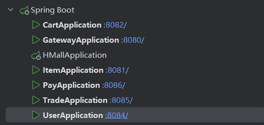
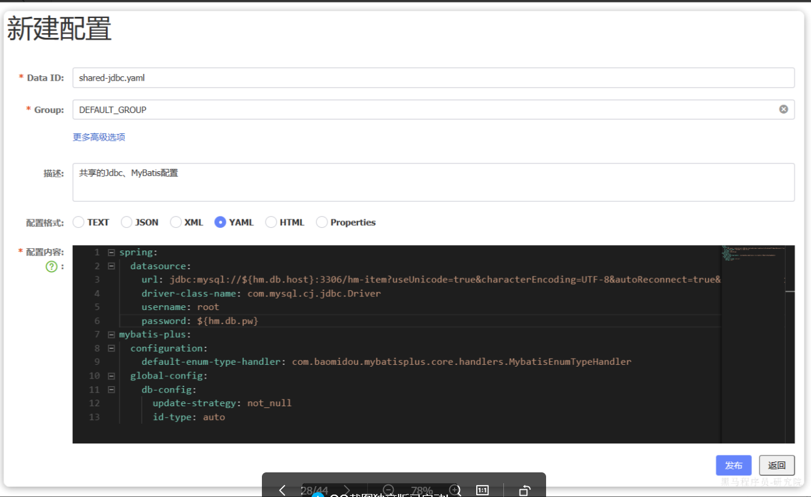

# 整体代码说明
## hm-service，不用管，微服务分离前的原项目，同理HMallApplication也不用启动
## hm-api
存openFeign远程调用的api，类似于rpc当中的代理
以及openFeign的配置类和DTO
client就是各个客户端代理
fallback用于sentinel的降级、快速失败
## hm-common
- 用到的通用异常处理器类
- 各种异常类
- 各种配置类，如json、Mq、Mvc、MyBatis
- 分页查询用到的通用类、通用结果类
- 拦截器，用于用户登录
- 各种工具类，比如BeanUtils、存储用户登录信息的UserContext实际上就是ThreadLocal的封装
## hm-gateway
SpringCloudGateway，也就是网关。
做网关鉴权：登录校验和传递用户信息；做统一路由等等
## hm-nginx
前端以及nginx代理，转发请求到后端

***
# 配置都有，重启项目的时候看这一节（包括navicat连接不上mysql，打不开nacos控制台）
- 镜像拉不下来：换镜像，可以使用临时命令拉，卡在下载阶段就重启虚拟机。
- nacos控制无法访问，`docker restart nacos`重启nacos容器
- navicat连接不上数据库，重启虚拟机，并重启mysql容器，见下面这一行
- 重启虚拟机的时候，docker（docker不自动启动的搜一下怎么在虚拟机开启的时候自启docker）会自动开启nacos容器，但是不会自动重启mysql容器：
  - `docker restart mysql`重启mysql容器
  - `docker restart nacos`重启nacos容器
  - 访问http://192.168.203.131:8848/nacos/正常后，`docker restart seata`重启seata容器，否则seata启动不起来
- cmd方式启动nginx
- idea启动各个服务，结果如图：
***
# 项目开启指南
## 可以参考这个文档
https://b11et3un53m.feishu.cn/wiki/R4Sdwvo8Si4kilkSKfscgQX0niB
## 先安装虚拟机，并在windows使用finalShell或其他连接虚拟机
## 下载docker，并配置镜像源
参照下面网页中的-镜像更换方法
https://docker.xuanyuan.me/
https://mp.weixin.qq.com/s?__biz=Mzg4ODQ1NTE2Mg==&mid=2247573614&idx=1&sn=6371a462fdccd91edf4bf7445f3adef6&chksm=cee53aae5c2744d86ab16201d665dfc0ad3a868f32bc55f070e82e6537d5cceaad2469173592&scene=27

## 虚拟机使用docker安装数据库，并配置数据库
1. 将该文件夹下的mysql文件夹放到虚拟机的/root中
2. 创建通用docker网络
```Bash
docker network create hm-net
```
3. 使用docker安装并配置mysql，启动mysql容器
```Bash
docker run -d \
  --name mysql \
  -p 3306:3306 \
  -e TZ=Asia/Shanghai \
  -e MYSQL_ROOT_PASSWORD=123 \
  -v /root/mysql/data:/var/lib/mysql \
  -v /root/mysql/conf:/etc/mysql/conf.d \
  -v /root/mysql/init:/docker-entrypoint-initdb.d \
  --network hm-net\
  mysql
```
注意，重启docker的mysql只需要`docker ps -a`查看是否已存在mysql容器，存在则直接启动`docker start mysql`

### windows下载navicat，图形化方式操作数据库，远程连接到虚拟机的mysql容器
使用navicat运行各个sql脚本（**除了nacos.sql和user.sql**），建立各个微服务的数据库
## 前端Nginx部署
1. 将本文件夹中的hmall-nginx放到一个不含中文的文件夹，比如我放到D盘
2. 进入该文件夹，**使用管理员cmd运行下面的不同命令来进行nginx部署**
```Bash
# 启动nginx
start nginx.exe
# 停止
nginx.exe -s stop
# 重新加载配置
nginx.exe -s reload
# 重启
nginx.exe -s restart
```
3. 访问http://localhost:18080

注意，上面启动nginx应该会出现问题，查看log下的error.log
- 如果是` [emerg] 53532#23980: CreateDirectory() "D:\hmall-nginx/temp/client_body_temp" failed (3: The system cannot find the path specified)`
则需要手动创建临时目录temp
- 如果是` [emerg] 60632#35676: bind() to 0.0.0.0:80 failed (10013: An attempt was made to access a socket in a way forbidden by its access permissions)`
则需要以管理员身份运行cmd,将conf目录下的nginx.conf文件中的
```Bash
listen       80;
```
改为一个大于1024的，比如
```Bash
listen       1080;
```
- 重新访问http://localhost:18080/

## Nacos
1. navicat连接虚拟机docker数据库
2. 在该数据库运行课前文件中的nacos.sql
3. 将改过ip地址配置(custom.env中的ip改为自己的)的课前文件中的nacos目录上传至虚拟机的/root目录(使用finalshell上传)
4. 虚拟机进入root，执行以下命令拉取nacos镜像并启动nacos容器
```Bash
docker run -d \
--name nacos \
--env-file ./nacos/custom.env \
-p 8848:8848 \
-p 9848:9848 \
-p 9849:9849 \
--restart=always \
nacos/nacos-server:v2.1.0-slim
```
5. 启动完成后，访问下面地址：http://192.168.203.131:8848/nacos/，注意将192.168.203.131替换为你自己的虚拟机IP地址。
6. 首次访问会跳转到登录页，账号密码都是nacos

7. 在idea项目中双击shift全局搜索server-addr，将nacos的server-addr改为`192.168.203.131:8848`

## yaml文件的mysql的db配置
**注意除了hm-api、hm-common、hm-gateway、hm-service**
user-service/src/main/resources/application.yaml
pay-service/src/main/resources/application.yaml
trade-service/src/main/resources/application.yaml
cart-service/src/main/resources/application.yaml
item-service/src/main/resources/application.yaml

以及各个db的配置
pay-service/src/main/resources/application-local.yaml
pay-service/src/main/resources/application-dev.yaml

host:192.168.203.131
password:123
注意pay-sevice的application.yaml 中数据库配置hm-pay库
注意user—service的jwt配置，和下面网关jwt配置一样
## 网关配置 
1. jwt配置，主要是`alias`和`password`
```yaml
hm:
  jwt:
    location: classpath:hmall.jks # 秘钥地址
    alias: hmall # 秘钥别名
    password: hmall123 # 秘钥文件密码
    tokenTTL: 30m # 登录有效期
  auth:
    excludePaths: # 无需登录校验的路径
      - /search/**
      - /users/login
      - /items/**
```

## nacos做配置中心 共享配置
以下配置都是在nacos控制台：http://192.168.203.131:8848/nacos/
账号密码都是`nacos`
左边点击配置管理-配置列表，点击右边加号
### jdbc配置
命名为`shared-jdbc.yaml`，Group`DEFAULT_GROUP`，描述自定

```yaml
spring:
  datasource:
    url: jdbc:mysql://${hm.db.host:192.168.203.131}:${hm.db.port:3306}/${hm.db.database}?useUnicode=true&characterEncoding=UTF-8&autoReconnect=true&serverTimezone=Asia/Shanghai
    driver-class-name: com.mysql.cj.jdbc.Driver
    username: ${hm.db.un:root}
    password: ${hm.db.pw:123}
mybatis-plus:
  configuration:
    default-enum-type-handler: com.baomidou.mybatisplus.core.handlers.MybatisEnumTypeHandler
  global-config:
    db-config:
      update-strategy: not_null
      id-type: auto
```
### log配置
命名为`shared-log.yaml`，Group同上`DEFAULT_GROUP`，描述自定
```yaml
logging:
  level:
    com.hmall: debug
  pattern:
    dateformat: HH:mm:ss:SSS
  file:
    path: "logs/${spring.application.name}"
```

### swagger配置，也就是接口展示的页面配置
命名为`shared-swagger.yaml`，Group同上`DEFAULT_GROUP`，描述自定
```yaml
knife4j:
  enable: true
  openapi:
    title: ${hm.swagger.title:东大集市接口文档}
    description: ${hm.swagger.description:东大集市接口文档}
    email: ${hm.swagger.email:2401265@stu.neu.edu.cn}
    concat: ${hm.swagger.concat:yinjianli}
    url: https://www.itcast.cn
    version: v1.0.0
    group:
      default:
        group-name: default
        api-rule: package
        api-rule-resources:
          - ${hm.swagger.package}
```
### 动态路由
hm-gateway:routers-DynamicRouteLoader可以监听nacos中的这个配置
并加入到网关的路由配置中
供网关使用的路由配置，命名为`gateway-routes.json`，Group同上`DEFAULT_GROUP`，描述自定
```gateway-routes.json
[
    {
        "id": "item",
        "predicates": [{
            "name": "Path",
            "args": {"_genkey_0":"/items/**", "_genkey_1":"/search/**"}
        }],
        "filters": [],
        "uri": "lb://item-service"
    },
    {
        "id": "cart",
        "predicates": [{
            "name": "Path",
            "args": {"_genkey_0":"/carts/**"}
        }],
        "filters": [],
        "uri": "lb://cart-service"
    },
    {
        "id": "user",
        "predicates": [{
            "name": "Path",
            "args": {"_genkey_0":"/users/**", "_genkey_1":"/addresses/**"}
        }],
        "filters": [],
        "uri": "lb://user-service"
    },
    {
        "id": "trade",
        "predicates": [{
            "name": "Path",
            "args": {"_genkey_0":"/orders/**"}
        }],
        "filters": [],
        "uri": "lb://trade-service"
    },
    {
        "id": "pay",
        "predicates": [{
            "name": "Path",
            "args": {"_genkey_0":"/pay-orders/**"}
        }],
        "filters": [],
        "uri": "lb://pay-service"
    }
]
```
### 注意：user-service还没用到共享配置
### 购物车共享配置（代码用，业务的配置），用作配置热更新展示
依然是nacos新建配置：`cart-service.yaml`,`DEFAULT_GROUP`
```yaml
hm:
  cart:
    maxAmount: 1 # 购物车商品数量上限
```

### 下面是微服务保护和分布式事务
### 微服务保护 sentinel
开启使用步骤：
1. 将课前文件中的（第二次传的文件）`sentinel-dashboard-1.8.6.jar`包放在任意非中文、不包含特殊字符的目录下，重命名为`sentinel-dashboard.jar`
2. 在jar包所在目录使用控制台，运行以下命令
```Bash
java -Dserver.port=8090 -Dcsp.sentinel.dashboard.server=localhost:8090 -Dproject.name=sentinel-dashboard -jar sentinel-dashboard.jar
```
3. 访问`http://localhost:8090`页面，就可以看到sentinel的控制台了：
4. 账号密码都是`sentinel`
微服务保护只保护了`cart-service`
因为：已经在`cart-service`的`application.yml`中添加了配置（不用改）
然后按照`https://b11et3un53m.feishu.cn/wiki/QfVrw3sZvihmnPkmALYcUHIDnff的day05`在控制台添加限流规则即可

### 分布式事务 seata
说明：seata需要持久化，所以我们选择数据库做持久化。seata通过docker部署，并**需要提前开启确保nacos、mysql，且都在hm-net网络**
开启使用步骤：
1. 使用navicat连接虚拟机的mysql后运行`seata-tc.sql`脚本
2. 将课前文件（资料/资料文件夹）中的seata整个文件夹（其中包含了seata运行时所需要的配置文件`application.yaml`）放到虚拟机的/root目录（finalshell传递文件）
3. 查看当前docker网络情况：`docker network inspect hm-net`。
如果发现mysql和nacos不在hm-net网络中，按照`docker network connect hm-net mysql`和`docker network connect hm-net nacos`来加入hm-net网络
4. 运行下面的docker命令启动seata，**注意：将SEATA_IP换成自己的虚拟机IP**
```Bash
docker run --name seata \
-p 8099:8099 \
-p 7099:7099 \
-e SEATA_IP=192.168.203.131 \
-v ./seata:/seata-server/resources \
--privileged=true \
--network hm-net \
-d \
seataio/seata-server:1.5.2
```
5. 按照前面的nacos小节共享配置教程，新建nacos的seata配置：`shared-seata.yaml`，`DEFAULT_GROUP`，内容如下,**注意nacos的ip换成自己的**
```yaml
seata:
  registry: # TC服务注册中心的配置，微服务根据这些信息去注册中心获取tc服务地址
    type: nacos # 注册中心类型 nacos
    nacos:
      server-addr: 192.168.203.131:8848 # nacos地址
      namespace: "" # namespace，默认为空
      group: DEFAULT_GROUP # 分组，默认是DEFAULT_GROUP
      application: seata-server # seata服务名称
      username: nacos
      password: nacos
  tx-service-group: hmall # 事务组名称
  service:
    vgroup-mapping: # 事务组与tc集群的映射关系
      hmall: "default"
```
6. seata需要使用db的数据，所以使用navicat运行课前资料中的`seata-at.sql`分别文件导入`hm-trade`、`hm-cart`、`hm-item`三个数据库中，注意是数据库层面：右键数据库运行脚本。
### 消息队列 rabbitMQ
1. 运行docker命令启动RabbitMQ
```Bash
docker run \
 -e RABBITMQ_DEFAULT_USER=hmall \
 -e RABBITMQ_DEFAULT_PASS=123 \
 -v mq-plugins:/plugins \
 --name mq \
 --hostname mq \
 -p 15672:15672 \
 -p 5672:5672 \
 --network hm-net\
 -d \
 rabbitmq:3.8-management
```
2. 访问 http://192.168.203.131:15672即可查看RabbitMQ控制台，账号hmall，密码123
3. 创建一个虚拟主机/hmall
4. 改造配置 抽取到nacos中的共享配置:shared-mq.yaml
```yaml
spring:
  rabbitmq:
    host: ${hm.mq.host:192.168.203.131} # 主机名
    port: ${hm.mq.port:5672} # 端口
    virtual-host: ${hm.mq.vhost:/hmall} # 虚拟主机
    username: ${hm.mq.un:hmall} # 用户名
    password: ${hm.mq.pw:123} # 密码
```
4. 安装插件实现延迟队列（15分钟延迟消息实现自动取消未支付订单，在trade-service的OrderServiceImpl实现方法，还没实现，整体过程要熟悉）
5. 定义一个自动配置类MqConsumeErrorAutoConfiguration，内容包括：
- 声明一个交换机，名为error.direct，类型为direct
- 声明一个队列，名为：微服务名 + error.queue，也就是说要动态获取
- 将队列与交换机绑定，绑定时的RoutingKey就是微服务名
- 声明RepublishMessageRecoverer，消费失败消息投递到上述交换机
- 给配置类添加条件，当spring.rabbitmq.listener.simple.retry.enabled为true时触发
